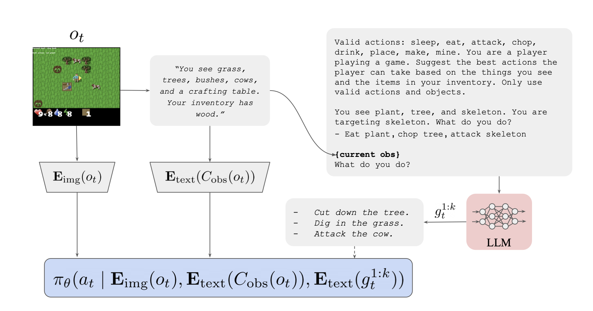

# Final Project of Reinforcement Learning Lecture (Roberto Capobianco, WS 2023/2024), Sapienza
**Fryderyk Mantiuk**, mail: mantiuk.2124851@studenti.uniroma1.it

**Clara Grotehans**, mail: grotehans.2121604@studenti.uniroma1.it

## Implementating "Guiding Pretraining in Reinforcement Learning with Large Language Models" by Y. Du, O. Watkins, et. al.
- [Link to Paper](https://arxiv.org/abs/2302.06692)
- [Link to Code Base](https://github.com/yuqingd/ellm)


# Project Guideline:
For an overview of this project, feel free to check out our presentation slides: [Link to Google Slides](https://docs.google.com/presentation/d/1FC5qDXxYHzkcpBPbW8-JyLjKATOi31dizvw4AiWmZJQ/edit?usp=sharing)

## 1. Installation (using conda)
```console
$ conda env create -f text_crafter_ellm.yml
```
## 2. Default Config Variables:
- ```name: CrafterTextEnv-v1```: Which gym environment is activated in init
- ```action_space_type: harder```: Every combination of all possible verbs, e.g.: "make, drink, etc." + all possible objects "tree, bush, plant, zombie", which therefore also includes non-sensical actions like "drink tree"
- ```env_reward: False``` Only use intrinsic reward for ELLM algorithm
- ```seed: 1```
- ```dying: True```: Agent can die during episode if health status is too low
- ```length: 400```: Maximum episode length
- ```similarity_threshold: 0.99```: What threshold to use when comparing the performed action and suggested goals of LLM goal generator with a cosine similarity
- ```check_ac_success: False```: i.e., when set to True, checks whether the agent targets the object of the action, which is always a combination of verb+object. E.g.: Agent targets tree, performed action is: "drink tree" --> Action would be considered as successfull, even though it is non-sensical. Therefore the agent would still be rewarded. We need this for Baselines where we do not use an LLM that should only suggest sensical and context-sensitive goals
- ```novelty_bias: False```: Each episode: only reward the agent for an action that they haven't performed and have been rewarded for yet --> filter goals suggestions 
- ```goal_generator: LLMGoalGenerator #Options: "LLMGoalGenerator", "ConstantGoalGenerator", "ConstantSamplerGoalGenerator"```: "LLMGoalGenerator" uses a LLM to suggest goals, For Baselines: "LLMGoalGenerator" suggests the whole action space as goals, "ConstantSamplerGoalGenerator" samples uniformly from the whole action space and suggests one goal each step
- ```language_model: mistral7binstruct  #Options: "mistral7binstruct", "testllm"``` [View Mistral Model on: Hugging Face](https://huggingface.co/mistralai/Mistral-7B-Instruct-v0.1)
- ```frame_stack: 4``` Agent sees the current and the last 3 frames each step


## 3. Start Training:
### 3.1. ELLM Training 
#### 3.1.a. With Novelty Bias
- **Language Model**: ```language_model: mistral7binstruct``` [View Mistral Model on: Hugging Face](https://huggingface.co/mistralai/Mistral-7B-Instruct-v0.1)
- **Goal Generator**: ```goal_generator: LLMGoalGenerator```
- **Novelty Bias**: ```novelty_bias: True```
- **Action Check**: ```check_ac_success: False``` - "False", because LLM should only suggest actions that are context-sensitive (because of prompting) and sensical (because of our common-sense hypothesis about LLMs).
```console
$ python train.py \ # Uses configs/default_config.yaml for default train parameters
```
#### 3.1.a. Without Novelty Bias
- **Language Model**: ```language_model: mistral7binstruct``` [View Mistral Model on: Hugging Face](https://huggingface.co/mistralai/Mistral-7B-Instruct-v0.1)
- **Goal Generator**: ```goal_generator: LLMGoalGenerator```
- **Novelty Bias**: ```novelty_bias: False``` - Agent gets rewarded for actions he already performed previously
- **Action Check**: ```check_ac_success: False``` - "False", because LLM should only suggest actions that are context-sensitive (because of prompting) and sensical (because of our common-sense hypothesis about LLMs).
```console
$ python train.py --novelty_bias False\ # Uses configs/default_config.yaml for default train parameters
```

### 3.2. Baseline Training: Novelty (context-sensitive, but potentially nonsensical actions are rewarded + Novelty bias)
- **Language Model**: ```language_model: None```
- **Goal Generator**: ```goal_generator: ConstantGoalGenerator```, which outputs the whole action space as suggested goals on each step 
- **Novelty Bias**: ```novelty_bias: True```
- **Action Check**: ```check_ac_success: True```, such that only context-sensitive goals can be rewarded.
```console
$ python train.py \ # Uses configs/default_config.yaml for default train parameters
    --goal_generator ConstantGoalGenerator\
    --novelty_bias True \
    --check_ac_success True
```


### 3.3. Baseline Training: Uniform (context-sensitive, but nonsensical actions are rewarded + Sampling from action space)
- **Language Model**: None
- **Goal Generator**: Constant Sampler Goal Generator, which outputs the action space as suggested goals on each step (```goal_generator: ConstantSamplerGoalGenerator```)
- **Novelty Bias**: ```novelty_bias: False```
- **Action Check**: ```check_ac_success: False```, such that only context sensitive goals can be rewarded. 
```console
$ python train.py \ # Uses configs/default_config.yaml for default train parameters
    --goal_generator ConstantSamplerGoalGenerator\
    --novelty_bias False \
    --check_ac_success True
```

